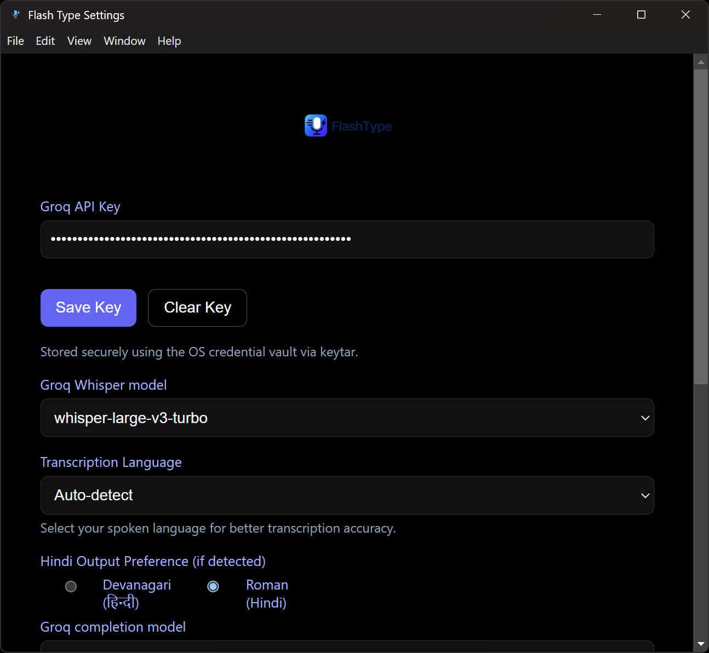
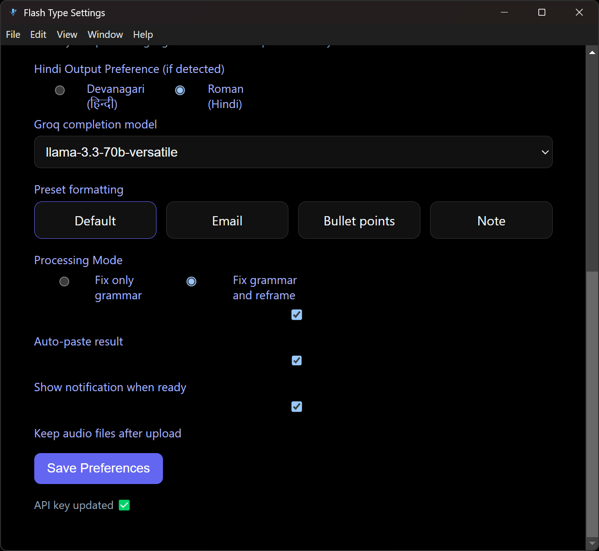

# Flash Type ⚡🎤

**Turn your voice into perfectly polished text, instantly.**

Flash Type is a powerful desktop utility that lets you type with your voice anywhere on your computer. But unlike standard dictation, it doesn't just transcribe what you say—it uses advanced AI to **clean up your grammar**, **rephrase your thoughts**, or **format your text** automatically.

Whether you're writing a professional email, drafting a quick note, or creating a bulleted list, just speak naturally and let Flash Type handle the rest.

---

## 📥 Installation

### 🔴 If Windows Blocks the Installer (Smart App Control)

Some versions of Windows 11 may block the installer with messages like:

> “Smart App Control blocked an app that may be unsafe…”

This happens because the Flash Type installer is **not digitally signed** yet — it doesn’t mean the app is unsafe.
### Disable Smart App Control (Recommended for Installation)

1. Open **Settings** (Win + I)
2. Go to **Privacy & Security**
3. Click **Windows Security**
4. Click **App & browser control**
5. Click **Smart App Control settings**
6. Select **Off**
7. **Restart your PC** (required)

After rebooting, run the Flash Type installer again — it will install normally.

> **Note:** Disabling SAC does *not* disable Windows Defender, real-time protection, or your antivirus. It only turns off the strict Smart App Control layer.

---
## 📸 Working Proof of Flash Type

### 🔹 Main Screen


### 🔹 Settings Panel




### 🔹 Auto-Pasted Output


---

### Download & Install (Windows)

**Step 1: Get the Installer**

* Download the latest `Flash Type Setup.exe` from the releases page
* OR build it yourself (see "Building from Source" below)

**Step 2: Run the Installer**

1. **Locate the installer**: Navigate to where you downloaded/built `Flash Type Setup 1.0.0.exe`

2. **Run as Administrator** (Important!):

   * Right-click on `Flash Type Setup 1.0.0.exe`
   * Select **"Run as administrator"**
   * Click "Yes" when Windows asks for permission

3. **Antivirus Warning** (if prompted):

   * If Windows Defender or your antivirus blocks the app, click "More info" → "Run anyway"
   * Or temporarily pause real-time protection during installation
   * This happens because the app isn't digitally signed (it's safe!)

4. **Complete the Setup**:

   * Choose installation location (default is recommended:
     `C:\Users\[YourName]\AppData\Local\Programs\Flash Type`)
   * Check "Create desktop shortcut" (recommended)
   * Click "Install" and wait for completion
   * Click "Finish" when done

**Step 3: Launch Flash Type**

1. Find the Flash Type icon on your desktop or in the Start Menu
2. **First launch**: Right-click the shortcut → **"Run as administrator"**
3. Look for the microphone icon in your system tray
4. If the icon appears, the app is running successfully!
5. ADD YOUR GROQ API KEY

**Step 4: Verify the Hotkey Works**

1. Open any text editor
2. Click in a text field
3. Press **Ctrl+Alt+V**
4. Recording window should appear
5. If yes — you're all set!

---


### 🛠️ Building from Source (For Developers)

**Prerequisites:**

| Requirement | Version | Installation |
| :--- | :--- | :--- |
| Node.js | v18 or higher | [Download from nodejs.org](https://nodejs.org/) |
| npm | v9 or higher | Comes with Node.js |
| Git | Any recent version | [Download from git-scm.com](https://git-scm.com/) |

**Installing Prerequisites on Windows:**

```powershell
# Option 1: Using winget (Windows Package Manager)
winget install OpenJS.NodeJS.LTS
winget install Git.Git

# Option 2: Using Chocolatey
choco install nodejs-lts
choco install git

# Option 3: Using Scoop
scoop install nodejs-lts
scoop install git
```

**Verify Installation:**

```bash
node --version    # Should show v18.x.x or higher
npm --version     # Should show v9.x.x or higher
git --version     # Should show git version 2.x.x
```

**Build Steps:**

```bash
# 1. Clone the repository (or download the source code)
git clone <repository-url>
cd Voice_typer

# 2. Install dependencies
npm install

# 3. Build the Windows installer
npm run dist
```

This generates `dist/Flash Type Setup 1.0.0.exe` (~150-200 MB NSIS installer).

**Development Mode:**

To run the app without building an installer:

```bash
npm start
# or
npm run dev
```

**Testing:**

```bash
npm test
```

---

### 🔧 Troubleshooting Installation

**Problem: Installer won't run or shows "Windows protected your PC"**
- Solution: Click "More info" → "Run anyway". The app is safe but not digitally signed.
- Alternative: Run from elevated Command Prompt:
  ```cmd
  cd path\to\installer
  "Flash Type Setup 1.0.0.exe"
  ```

**Problem: Installation fails silently**
- Close all running instances of Flash Type or Electron apps
- Check Windows Event Viewer (Windows Logs → Application) for error details
- Ensure you have administrator privileges
- Try installing to a different directory

**Problem: App installs but Ctrl+Alt+V doesn't work**
- Make sure the app is running (check system tray for microphone icon)
- Another app may be using the same hotkey (close Microsoft Teams, Slack, Dragon, etc.)
- Right-click the Flash Type shortcut → "Run as administrator"
- Use the tray menu as a workaround: Right-click microphone icon → "Start Recording"

**Problem: Antivirus keeps blocking the app**
- Add Flash Type to your antivirus exclusion list
- Whitelist the installation folder: `C:\Users\[YourName]\AppData\Local\Programs\Flash Type`

**Problem: Multiple instances running**
- Flash Type uses a single-instance lock. If you see duplicates:
  - Open Task Manager (Ctrl+Shift+Esc)
  - End all "Flash Type" processes
  - Restart the app

---

### 📂 Portable Version (No Installer)

If you prefer a portable .exe without installation:

1. Edit `package.json` → change `"win": { "target": ["nsis"] }` to `"win": { "target": ["portable"] }`
2. Run `npm run dist`
3. Find the portable executable in `dist/`
4. Run it directly from any folder (no installation needed)

---

## 🚀 Key Features

*   **Global Hotkey:** Press `Ctrl + Alt + V` anywhere to start or stop recording.
*   **Smart AI Processing:** Uses **Groq** (Whisper + Llama) to transcribe and refine your text at lightning speed.
*   **Context Aware:** Can fix grammar or completely reframe your rambling thoughts into clear sentences.
*   **Formatting Presets:** Automatically format your speech as:
    *   📧 **Emails** (Professional & concise)
    *   📝 **Bullet Points** (Great for meetings)
    *   🗒️ **Notes** (Clean & simple)
*   **Auto-Paste:** The text is automatically typed into your active window (Word, Slack, Notepad, Browser, etc.).
*   **Privacy Focused:** Your audio is processed securely via your own API key and never stored by us.

---

## 💰 Cost Comparison

Flash Type uses your own **Groq API Key**, which is currently one of the fastest and cheapest ways to run AI models.

| Service | Cost | Model |
| :--- | :--- | :--- |
| **Flash Type (via Groq)** | **~$0.11 / hour** | `whisper-large-v3` (State of the art) |
| **Flash Type (via Groq)** | **~$0.02 / hour** | `distil-whisper` (Ultra fast) |
| Wispr Flow (SaaS) | $12 - $15 / month | Subscription Plan |

*With Groq, you only pay for what you use. For most casual users, it costs pennies per month.*

---

## 🛠️ One-Time Setup

To give you the best AI performance at the lowest cost, this app requires a **Groq API Key**.

### 1. Get your Free/Cheap API Key
Groq offers incredible speed and very generous free tiers (or extremely low costs).
1.  Go to [console.groq.com](https://console.groq.com/).
2.  Sign up or Log in.
3.  Click **"Create API Key"**.
4.  Copy the key (it starts with `gsk_...`).

### 2. Configure Flash Type
1.  Open **Flash Type**.
2.  Find the microphone icon in your system tray (bottom right of your screen, near the clock).
3.  Right-click the icon and select **Settings**.
4.  Paste your key into the **Groq API Key** field.
5.  Click **Save**.

*That's it! You're ready to go.*

---

## 📖 How to Use

### Basic Workflow
1.  **Place your cursor** where you want to type (e.g., inside a text box, email body, or document).
2.  Press **`Ctrl + Alt + V`**.
    *   A small recording window will appear in the bottom-right corner.
3.  **Speak** your thoughts naturally.
    *   *Don't worry about "ums", "ahs", or correcting yourself—the AI will fix it!*
4.  Press **`Ctrl + Alt + V`** again to stop.
    *   You'll see a notification that processing has started.
5.  ✨ **Watch the magic:** In a few seconds, your perfect text will be pasted right where your cursor was!

### Changing Modes & Presets
Want to write an email instead of just fixing grammar?
1.  Open **Settings** (Right-click tray icon).
2.  **Processing Mode:**
    *   **Grammar Only:** Keeps your exact words but fixes spelling/grammar.
    *   **Grammar + Reframe:** Smooths out sentences to sound more professional.
3.  **Preset:**
    *   Choose **Email**, **Bullet Points**, or **Default** to change how the final text looks.

---

## ⚙️ Settings Explained

*   **Transcription Model:** The AI that listens to your voice (Default: `whisper-large-v3-turbo`).
*   **Completion Model:** The AI that polishes your text (Default: `llama-3.1-8b-instant`).
*   **Auto-Paste:** When enabled, the app types the text for you. If disabled, it copies the text to your clipboard so you can paste it manually (`Ctrl + V`).
*   **Hindi Script Preference:** If you speak in Hindi, choose whether you want the output in Devanagari script or Latin (English) letters.

---

## ❓ FAQ & Troubleshooting

**Q: Nothing happens when I press Ctrl+Alt+V.**
*   **Check if the app is running**: Look for the microphone icon in your system tray (bottom-right corner, near the clock).
*   **Another app using the hotkey**: Close other voice/dictation apps (Dragon, Windows Voice Typing, etc.) that might be using Ctrl+Alt+V.
*   **Try the tray menu**: Right-click the tray icon and select "Start Recording" as an alternative.
*   **Restart the app**: Right-click tray icon → Quit, then launch Flash Type again.
*   **Run as administrator**: Some Windows systems require admin rights for global hotkeys. Right-click the Flash Type shortcut and select "Run as administrator".
*   **Windows permissions**: If you see a notification saying the hotkey failed to register, try:
    - Closing apps like Microsoft Teams, Slack, or other tools with global shortcuts
    - Checking Windows Settings → Privacy → Background apps (ensure Flash Type is allowed)

**Q: It says "Groq API key missing".**
*   You need to enter your API key in the Settings menu. See the "One-Time Setup" section above.

**Q: The text didn't paste automatically.**
*   Make sure your cursor was focused in a text box *before* you started recording.
*   If security settings block the auto-typer, the text is also copied to your clipboard. Just press `Ctrl+V` to paste it manually.

**Q: Is it free?**
*   The app itself is free! Usage of the Groq API is subject to their pricing, which is currently extremely cheap (often free for low/moderate usage).

---

**Enjoy typing at the speed of thought!** 🚀
